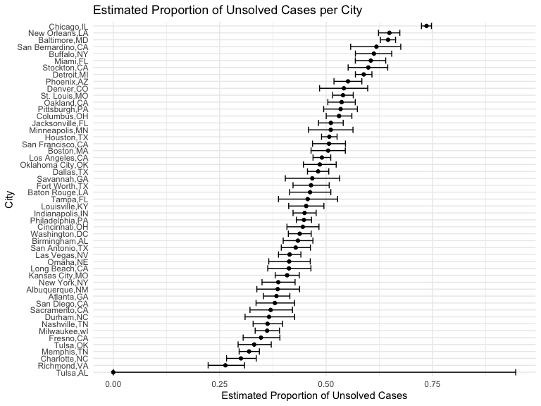

HW5
================
Matt Untalan

### Due date

Due: November 16 at 11:59pm.

### Points

| Problem         | Points    |
|:----------------|:----------|
| Problem 0       | 20        |
| Problem 1       | –         |
| Problem 2       | 40        |
| Problem 3       | 40        |
| Optional survey | No points |

### Problem 0

This “problem” focuses on structure of your submission, especially the
use git and GitHub for reproducibility, R Projects to organize your
work, R Markdown to write reproducible reports, relative paths to load
data from local files, and reasonable naming structures for your files.
This was not prepared as a GitHub repo.

``` r
library(tidyverse)
```

## Problem 2

The raw dataset includes 12 variables: the individual’s unique id
number; homicide report date (listed as yyyymmdd); victim information
such as first and last name, age, and sex; location of the homicide
including coordinates; and status of the case.

Create city_state variable and classify current disposition variable
into solved/unsolved

``` r
homicide = 
  read_csv("prob2_data/homicide-data.csv", na = c("", "Unknown")) %>%
  mutate(
    city_state = paste(city, state, sep=","),
    status = case_when(
        disposition == "Closed by arrest" ~ "Solved",
        disposition == "Closed without arrest" ~ "Unsolved",
        disposition == "Open/No arrest" ~ "Unsolved"))
```

    ## Rows: 52179 Columns: 12
    ## ── Column specification ────────────────────────────────────────────────────────
    ## Delimiter: ","
    ## chr (8): uid, victim_last, victim_first, victim_race, victim_sex, city, stat...
    ## dbl (4): reported_date, victim_age, lat, lon
    ## 
    ## ℹ Use `spec()` to retrieve the full column specification for this data.
    ## ℹ Specify the column types or set `show_col_types = FALSE` to quiet this message.

Unsolved Cases for Baltimore

``` r
balt = 
  homicide %>%
  filter(city_state == "Baltimore,MD")

balt_sum =
  balt %>%
  summarize(
    unsolved = sum(status == "Unsolved"),
    n = n()
  )

balt_prop = 
  prop.test(
    x =
      balt_sum %>%
      pull(unsolved),
    n =
      balt_sum %>%
      pull(n)
  )

broom::tidy(balt_prop) %>%
  select(estimate, conf.low, conf.high) %>%
  knitr::kable()
```

|  estimate |  conf.low | conf.high |
|----------:|----------:|----------:|
| 0.6455607 | 0.6275625 | 0.6631599 |

The estimated proportion of homicides that are unsolved in Baltimore, MD
is 64.556%. We are 95% confident that the true proportion falls in
between 62.756% and 66.316%.

Unsolved Cases for All Cities

``` r
prop_test_all = function(cities) {
  city_tot =
    cities %>%
    summarize(
      unsolved = sum(status == "Unsolved"),
      n = n()
    )
  city_prop = 
     prop.test(
    x =
      city_tot %>%
      pull(unsolved),
    n =
      city_tot %>%
      pull(n)
  )
  return(city_prop)
}

city_crime = 
  homicide %>%
  relocate(city_state) %>%
  nest(data = uid:status) %>%
  mutate(
      results = map(data, prop_test_all),
      results_tidy = map(results, broom::tidy)
  ) %>%
  select(city_state, results_tidy) %>%
  unnest(results_tidy) %>%
  select(city_state, estimate, conf.low, conf.high) %>%
  janitor::clean_names()
```

Unsolved Homicides by City Plot

``` r
city_crime %>%
  mutate(
    city_state = fct_reorder(city_state, estimate)
  ) %>%
  ggplot(aes(x = city_state, y = estimate)) +
  geom_point() +
  geom_errorbar(aes(ymin = conf_low, ymax = conf_high)) +
  labs(title = "Estimated Proportion of Unsolved Cases per City",
       x = "City",
       y = "Estimated Proportion of Unsolved Cases") +
  coord_flip()
```


