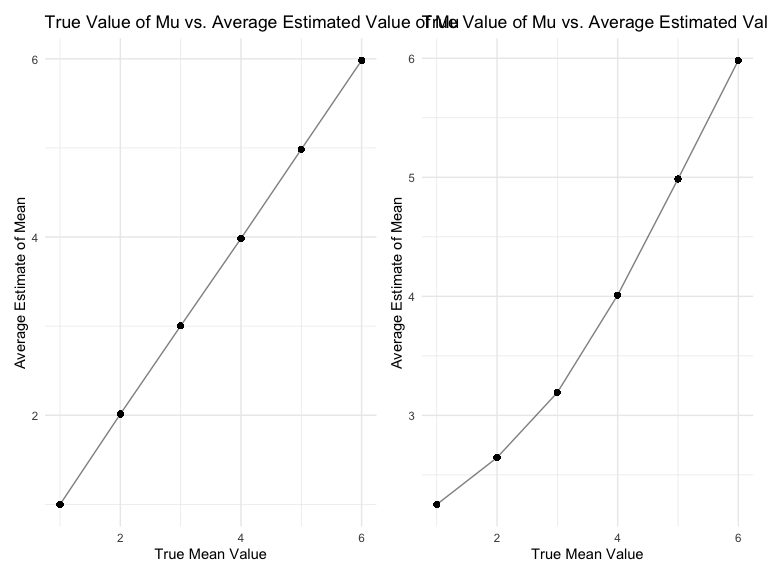

HW5
================
Matt Untalan

### Due date

Due: November 16 at 11:59pm.

### Points

| Problem         | Points    |
|:----------------|:----------|
| Problem 0       | 20        |
| Problem 1       | –         |
| Problem 2       | 40        |
| Problem 3       | 40        |
| Optional survey | No points |

### Problem 0

This “problem” focuses on structure of your submission, especially the
use git and GitHub for reproducibility, R Projects to organize your
work, R Markdown to write reproducible reports, relative paths to load
data from local files, and reasonable naming structures for your files.
This was not prepared as a GitHub repo.

``` r
library(tidyverse)
```

## Problem 2

The raw dataset includes 12 variables: the individual’s unique id
number; homicide report date (listed as yyyymmdd); victim information
such as first and last name, age, and sex; location of the homicide
including coordinates; and status of the case.

Create city_state variable and classify current disposition variable
into solved/unsolved

``` r
homicide = 
  read_csv("prob2_data/homicide-data.csv", na = c("", "Unknown")) %>%
  mutate(
    city_state = paste(city, state, sep=","),
    status = case_when(
        disposition == "Closed by arrest" ~ "Solved",
        disposition == "Closed without arrest" ~ "Unsolved",
        disposition == "Open/No arrest" ~ "Unsolved"))
```

    ## Rows: 52179 Columns: 12
    ## ── Column specification ────────────────────────────────────────────────────────
    ## Delimiter: ","
    ## chr (8): uid, victim_last, victim_first, victim_race, victim_sex, city, stat...
    ## dbl (4): reported_date, victim_age, lat, lon
    ## 
    ## ℹ Use `spec()` to retrieve the full column specification for this data.
    ## ℹ Specify the column types or set `show_col_types = FALSE` to quiet this message.

Unsolved Cases for Baltimore

``` r
balt = 
  homicide %>%
  filter(city_state == "Baltimore,MD")

balt_sum =
  balt %>%
  summarize(
    unsolved = sum(status == "Unsolved"),
    n = n()
  )

balt_prop = 
  prop.test(
    x =
      balt_sum %>%
      pull(unsolved),
    n =
      balt_sum %>%
      pull(n)
  )

broom::tidy(balt_prop) %>%
  select(estimate, conf.low, conf.high) %>%
  knitr::kable()
```

|  estimate |  conf.low | conf.high |
|----------:|----------:|----------:|
| 0.6455607 | 0.6275625 | 0.6631599 |

The estimated proportion of homicides that are unsolved in Baltimore, MD
is 64.556%. We are 95% confident that the true proportion falls in
between 62.756% and 66.316%.

Unsolved Cases for All Cities

``` r
prop_test_all = function(cities) {
  city_tot =
    cities %>%
    summarize(
      unsolved = sum(status == "Unsolved"),
      n = n()
    )
  city_prop = 
     prop.test(
    x =
      city_tot %>%
      pull(unsolved),
    n =
      city_tot %>%
      pull(n)
  )
  return(city_prop)
}

city_crime = 
  homicide %>%
  relocate(city_state) %>%
  nest(data = uid:status) %>%
  mutate(
      results = map(data, prop_test_all),
      results_tidy = map(results, broom::tidy)
  ) %>%
  select(city_state, results_tidy) %>%
  unnest(results_tidy) %>%
  select(city_state, estimate, conf.low, conf.high) %>%
  janitor::clean_names()
```

Unsolved Homicides by City Plot

``` r
city_crime %>%
  mutate(
    city_state = fct_reorder(city_state, estimate)
  ) %>%
  ggplot(aes(x = city_state, y = estimate)) +
  geom_point() +
  geom_errorbar(aes(ymin = conf_low, ymax = conf_high)) +
  labs(title = "Estimated Proportion of Unsolved Cases per City",
       x = "City",
       y = "Estimated Proportion of Unsolved Cases") +
  coord_flip()
```


## Problem 3

Generate Datasets with Design Elements; Estimate Mu and P-value

``` r
mu0_datasets = map(1:5000, ~ rnorm(n = 30, mean = 0, sd = 5))

estimate = function(n_obs = 30, mu, sigma = 5) {
  x = rnorm(n = n_obs, mean = mu, sd = sigma)
  tibble(mu_hat = mean(x),
         p = t.test(x, mu = 0)$p.value
         )
}

mu0_ttest = 
  expand_grid(n = 30, mu = 0, sigma = 5, dataset = 1:5000) %>%
  mutate(est_dataset = map(.x = mu, ~ estimate(mu = .x))) %>%
  unnest(est_dataset)

mu_repeat_ttest = 
  expand_grid(n = 30, mu = c(1,2,3,4,5,6), sigma = 5, dataset = 1:5000) %>%
  mutate(est_dataset = map(.x = mu, ~ estimate(mu = .x))) %>%
  unnest(est_dataset)
```

Plot for Assessing Power in Part 1

``` r
power = 
  mu_repeat_ttest %>%
  group_by(mu) %>%
  summarise(
    rejectH0 = sum(p < 0.05),
    count = n()
  ) %>%
  mutate(prop_rejectH0 = rejectH0/count) %>%
  ggplot(aes(x = mu, y = prop_rejectH0)) + 
  geom_point(alpha = 0.5) + 
  geom_line(alpha = 0.5) +
  labs(title = "Proportion of Null Hypothesis Rejection by True Mean",
       x = "True Mean (mu)",
       y = "Proportion of Null Hypothesis Rejections")
```

As the true mean and effect size increase, the power also increases. By
a true mean of 4, power nears 1.

Plots for Part 2

``` r
library(patchwork)

mu_plot =
  mu_repeat_ttest %>%
  group_by(mu) %>%
  mutate(avg_muhat = mean(mu_hat)) %>%
  ggplot(aes(x = mu, y = avg_muhat)) +
  geom_point() + 
  geom_line(alpha = 0.5) + 
  labs(title = "True Value of Mu vs. Average Estimated Value of Mu",
       x = "True Mean Value",
       y = "Average Estimate of Mean")

mu_plot_reject =
  mu_repeat_ttest %>%
  filter(p < 0.05) %>%
  group_by(mu) %>%
  mutate(avg_muhat = mean(mu_hat)) %>%
  ggplot(aes(x = mu, y = avg_muhat)) +
  geom_point() + 
  geom_line(alpha = 0.5) + 
  labs(title = "True Value of Mu vs. Average Estimated Value of Mu",
       x = "True Mean Value",
       y = "Average Estimate of Mean")

mu_plot + mu_plot_reject
```



When accounting for all estimated means, the average estimated mean
appears to be equal to the true mean value. However, when we only
include samples for which the null hypothesis is rejected, at smaller
true means, the average estimated mean tends to be an overestimate of
the true mean. The larger the true mean, the more closely the average
estimated mean matches when only using samples that had rejected the
null hypothesis. Since larger mean values contribute to larger effect
sizes when assessing the null hypothesis in a t-test, these larger mean
values will benefit from higher power and thus a more accurate average
estimate when only using samples that rejected the null.
